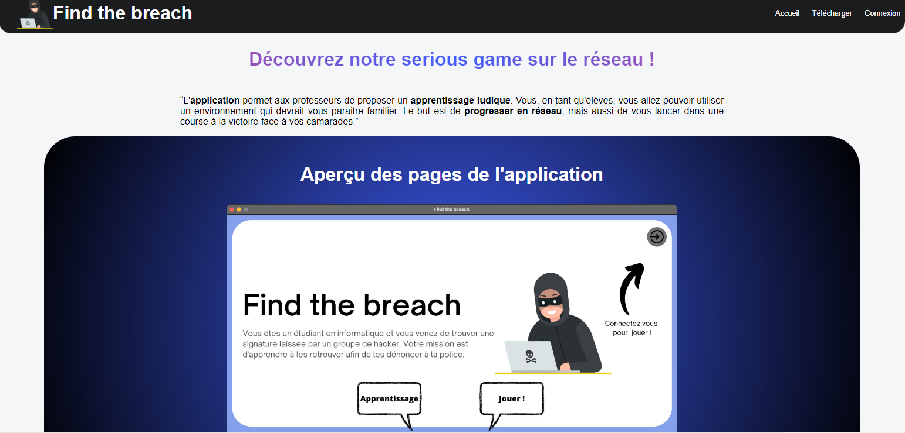
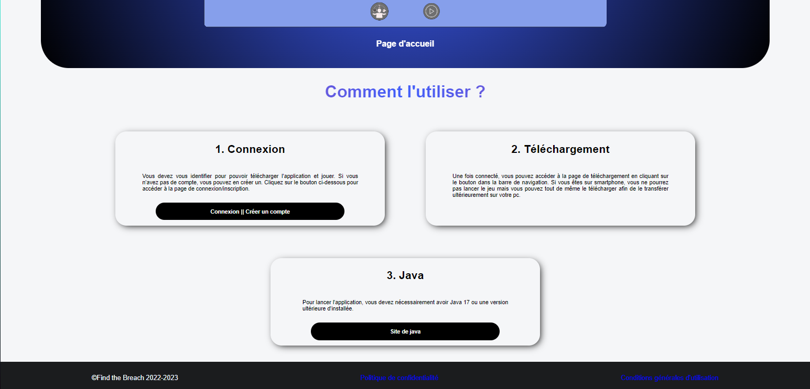
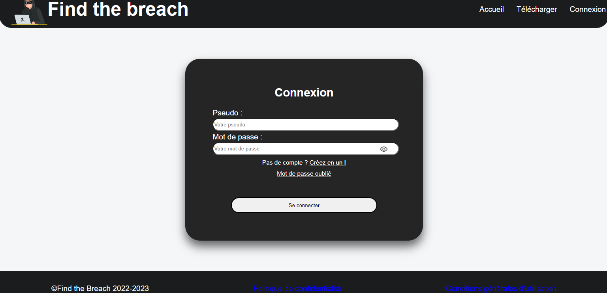
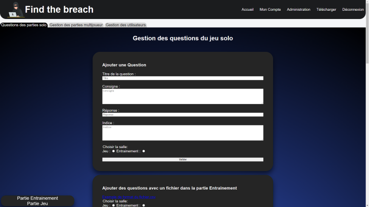

# SAE-S4-Site

## Guide d'utilisation Site Web

- Page d'acceuil :

Lorsque vous accédez à la page d'accueil, vous avez la possibilité de lire un texte expliquant le but de cette application ainsi qu’un aperçu de l'application. Nous voulons que vous ayez une idée claire de ce que notre application peut faire pour vous avant de la télécharger. De plus, le site nous offre la possibilité de télécharger l’application si nous sommes connectés. Ainsi, si nous ne sommes connectés, il suffit d’appuyer sur « Connexion | Créer un compte » afin de pouvoir s’identifier. 

- Page de connexion :

  Cette page nous offre la possibilité de se connecter. Si nous avons oublié notre mot de passe , nous nous diriger vers la page « Mot de passe oublié ». Cependant, si nous n’avons pas de compte , nous pouvons cliquer sur « Créez en un » afin de s’inscrire. 

- Page pour mot de passe oublié :

Cette page nous permet de faire une demande afin de changer de mot de passe lorsque nous avons oubliés ce dernier. Si nous avons indiqués une adresse mail qui est présente dans nos données, un mail nous est envoyé avec un Token .

Ce Token nous permet d'effectuer une double authentification afin de sécuriser au maximum notre compte.

**Après nous être connectés en tant que joueur :**

Après nous être connecté, il est possible dans un 1er temps de télécharger l’application.

Ici, il est possible de modifier son mot de passe , observer les scores obtenues durant nos différentes parties et nos commentaires.

**Connecté en tant qu'administrateur*

Lorsque nous sommes connectés avec un compte administrateur , nous avons différentes possibilités.

En effet, nous pouvons cliquer sur "Administrateur".
- Page adminstrateur :
  * Question des parties solo

  

